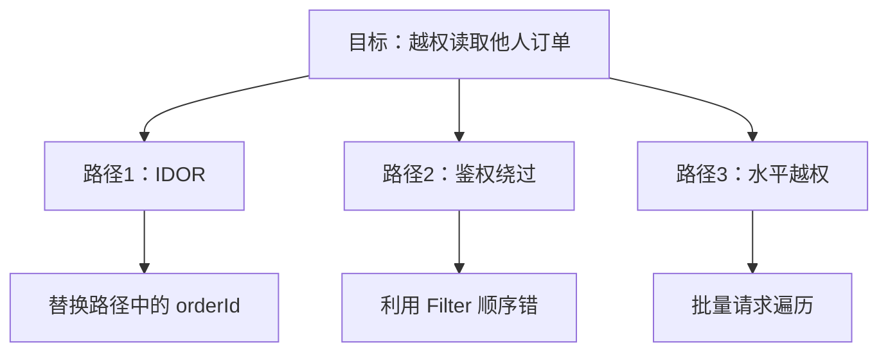

# 威胁建模分析（threat-model-analyst）

> 必加 skill，Phase 2 核心。缺失时 Phase 2 **不降级**，直接启动失败。

## 一、核心职责

1. **STRIDE 分析**：6 维度威胁分类
2. **攻击树**：从威胁反推攻击路径
3. **数据流图（DFD）**：绘制信任边界 + 数据流
4. **模块调用关系**：UML sequenceDiagram / 组件图

## 二、必读

- `行为准则/必读/04-中文输出硬约束.md`

## 三、输入

- 项目技术栈（从代码扫描获取）
- 业务文档（`doc/` 下）
- 模块清单（Phase 1 产出）

## 四、产出

### 4.1 威胁分析报告
- 路径：`loop_audit/threat-model.md`
- 包含：STRIDE 矩阵 + 攻击树（mermaid）+ 模块信任边界

### 4.2 数据流图
- 格式：**drawio**（用户环境 Obsidian 可渲染）
- 路径：`loop_audit/dfd-{项目}.drawio`
- 元素：外部实体 / 进程 / 数据存储 / 信任边界

### 4.3 模块分析
- 路径：`loop_audit/modules/模块分析.md`
- 包含：模块清单 + 协议说明 + 调用关系图（UML）

## 五、STRIDE 分类

| 类别 | 威胁 | 检测 |
|------|------|------|
| **S**poofing | 身份伪造 | 认证机制缺失 / 弱口令 |
| **T**ampering | 数据篡改 | 缺少完整性校验 |
| **R**epudiation | 抵赖 | 缺少审计日志 |
| **I**nfo Disclosure | 信息泄露 | 异常 / 响应含敏感信息 |
| **D**enial of Service | 拒绝服务 | 无 rate limit |
| **E**levation of Privilege | 提权 | 越权 / 弱鉴权 |

## 六、攻击树示例

## 七、与其他 Phase 的衔接

- 输出模块清单 → Phase 3 鉴权组件分析
- 输出威胁清单 → Phase 5 漏洞发现的"高优先级端点"标记
- DFD 中的信任边界 → Phase 5 端点枚举的入口判断
